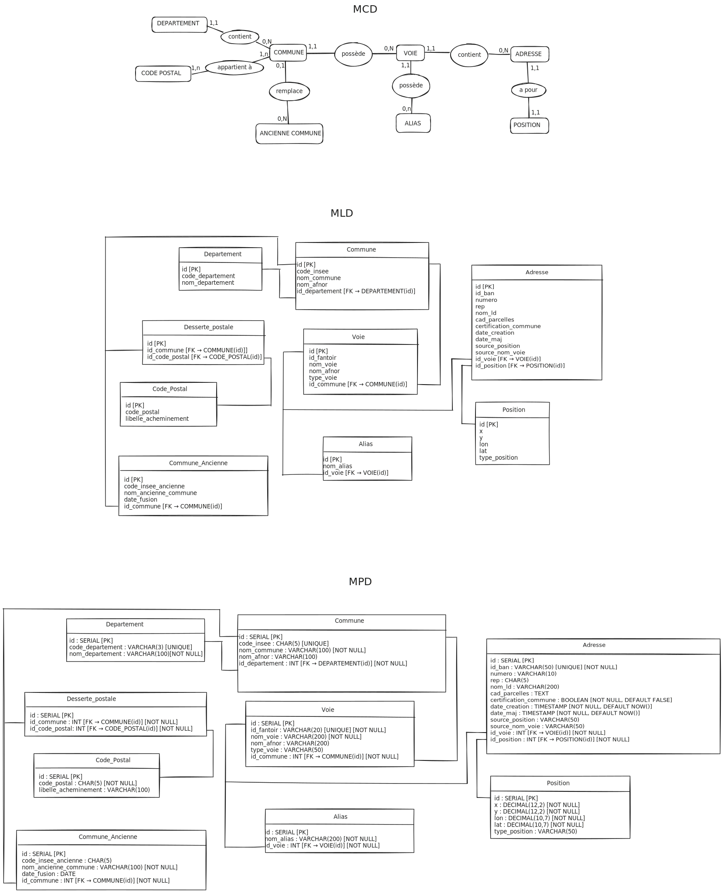

# Documentation Base de Données

## 📊 Modèle Conceptuel de Données (MCD) / Modèle Logique de Données (MLD) / Modèle Physique de Données (MPD)

### Diagramme

---

## 📖 Dictionnaire de Données

Le dictionnaire de données complet est disponible sur Google Sheets :

**[📋 Accéder au Dictionnaire de Données](https://docs.google.com/spreadsheets/d/1TNfp6AwvgOe9FjVft3NHIdUts1PMQa4KPvzGpmeNxPA/edit?usp=sharing)**

---

### Description

Ce document présente la modélisation complète de la base de données :

- **MCD (Modèle Conceptuel de Données)** : Représentation abstraite des entités et de leurs relations
- **MLD (Modèle Logique de Données)** : Traduction du MCD en modèle relationnel
- **MPD (Modèle Physique de Données)** : Implémentation technique avec les types de données PostgreSQL

Le dictionnaire de données associé détaille l'ensemble des tables, colonnes, types de données, contraintes et relations.
